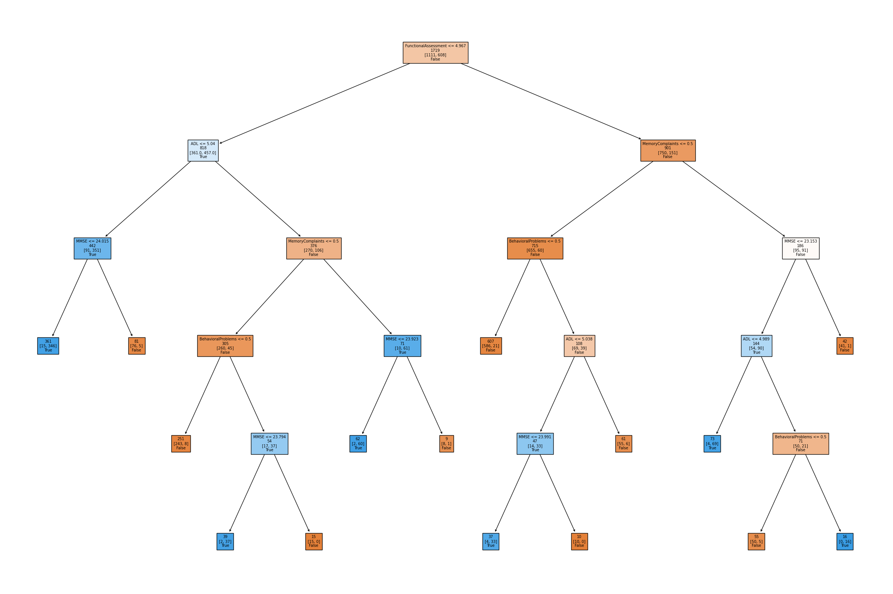

# Alzheimer's Disease Diagnosis

Binary classifier trained on the [Alzheimer's Disease Dataset](https://www.kaggle.com/datasets/rabieelkharoua/alzheimers-disease-dataset) for educational purposes.

## Experiments

Features were selected by means of univariate statistical tests. 

```
Best features: ['MMSE', 'FunctionalAssessment', 'ADL', 'MemoryComplaints', 'BehavioralProblems']
```

Stratified 10-fold cross-validation, repeated 10 times, was carried out on a variety of algorithms. For each of them, a grid search was also performed with a nested stratified 10-fold cross-validation, in order to find the optimal hyper-parameters. 

Hyper-parameters were tuned with the objective of optimizing the F1-score (harmonic mean of precision and recall). This metric was chosen as the target over the accuracy, because of the class imbalance in the dataset favoring the negative examples: optimizing both the precision (proportion of positive predictions that are actually correct) and the recall (proportion of positive examples that have been identified) makes the model less biased towards the negative classifications. To this end, the cost of false negatives (misclassification of positive examples as negative examples) was also tuned during grid search, when cost-sensitive learning was supported by the algorithm.

The most promising learning schemes ended up being those corresponding with the decision tree and with the random forest algorithms, with the latter slightly surpassing the former on all metrics in a statistically significant manner. However, these differences are very small, especially on the final models (which were fit on the entire training set).

## K-fold cross-validation

| Model      | Accuracy           | Pos. Precision     | Neg. Precision     | Pos. Recall       | Neg. Recall       | Pos. F1           | Neg. F1           | ROC AUC           |
|------------|--------------------|--------------------|--------------------|-------------------|-------------------|-------------------|-------------------|-------------------|
| rf         | 95.5% (+/- 1.4%)    | 95.2% (+/- 2.8%)   | 95.7% (+/- 1.6%)   | 92.0% (+/- 3.1%)  | 97.4% (+/- 1.6%)  | 93.5% (+/- 2.0%)  | 96.5% (+/- 1.1%)  | 95.1% (+/- 1.9%)  |
| dt_pruned  | 95.0% (+/- 1.6%)    | 94.5% (+/- 2.8%)   | 95.3% (+/- 1.8%)   | 91.3% (+/- 3.5%)  | 97.1% (+/- 1.5%)  | 92.8% (+/- 2.4%)  | 96.2% (+/- 1.2%)  | 94.9% (+/- 1.9%)  |

## Final models

| Model      | Accuracy | Pos. Precision | Neg. Precision | Pos. Recall | Neg. Recall | Pos. F1 | Neg. F1 | ROC AUC |
|------------|----------|----------------|----------------|-------------|-------------|---------|---------|---------|
| rf         | 95.3%    | 94.6%          | 95.7%          | 92.1%       | 97.1%       | 93.3%   | 96.4%   | 94.6%   |
| dt_pruned  | 95.1%    | 94.6%          | 95.4%          | 91.4%       | 97.1%       | 93.0%   | 96.3%   | 94.3%   |

## Conclusions

While the random forest model performs slighly better, the decision tree model (shown below both in visual and textual form) may still be preferred for a matter of interpretability.



```
|--- FunctionalAssessment <= 4.97
|   |--- ADL <= 5.04
|   |   |--- MMSE <= 24.02
|   |   |   |--- class: 1
|   |   |--- MMSE >  24.02
|   |   |   |--- class: 0
|   |--- ADL >  5.04
|   |   |--- MemoryComplaints <= 0.50
|   |   |   |--- BehavioralProblems <= 0.50
|   |   |   |   |--- class: 0
|   |   |   |--- BehavioralProblems >  0.50
|   |   |   |   |--- MMSE <= 23.79
|   |   |   |   |   |--- class: 1
|   |   |   |   |--- MMSE >  23.79
|   |   |   |   |   |--- class: 0
|   |   |--- MemoryComplaints >  0.50
|   |   |   |--- MMSE <= 23.92
|   |   |   |   |--- class: 1
|   |   |   |--- MMSE >  23.92
|   |   |   |   |--- class: 0
|--- FunctionalAssessment >  4.97
|   |--- MemoryComplaints <= 0.50
|   |   |--- BehavioralProblems <= 0.50
|   |   |   |--- class: 0
|   |   |--- BehavioralProblems >  0.50
|   |   |   |--- ADL <= 5.04
|   |   |   |   |--- MMSE <= 23.99
|   |   |   |   |   |--- class: 1
|   |   |   |   |--- MMSE >  23.99
|   |   |   |   |   |--- class: 0
|   |   |   |--- ADL >  5.04
|   |   |   |   |--- class: 0
|   |--- MemoryComplaints >  0.50
|   |   |--- MMSE <= 23.15
|   |   |   |--- ADL <= 4.99
|   |   |   |   |--- class: 1
|   |   |   |--- ADL >  4.99
|   |   |   |   |--- BehavioralProblems <= 0.50
|   |   |   |   |   |--- class: 0
|   |   |   |   |--- BehavioralProblems >  0.50
|   |   |   |   |   |--- class: 1
|   |   |--- MMSE >  23.15
|   |   |   |--- class: 0
```
